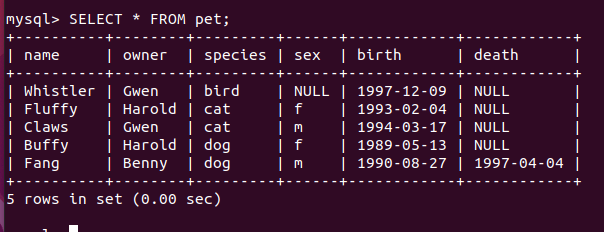
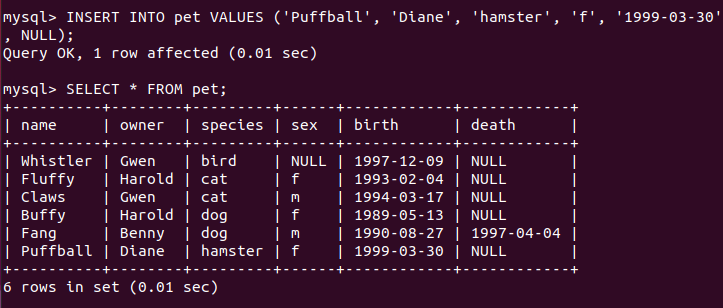
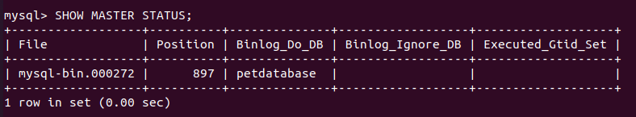

# Baitap_ch5_nhanban_nhatquan

Baitap_ch5_nhanban_nhatquan

## Cau 1: What is the output did you see? Now, try to add another entry to the table pet in using SQL queries

Firstime I saw



Add new entry :



## Cau 2: What is the name of the log file and the position?



## Cau 3 : Have you received this file in Slave machine? What is the path of this received file in the Slave machine?

Yes,
/path/to/petdatabase.sql.

## Cau 4 : What is the status information you received? How do you know the configuration is OK?

```
*************************** 1. row ***************************
           Slave_IO_State: Waiting for master to send event
              Master_Host: 12.34.56.789
              Master_User: slave_user
              Master_Port: 3306
            Connect_Retry: 60
          Master_Log_File: mysql-bin.000001
      Read_Master_Log_Pos: 107
           Relay_Log_File: mysqld-relay-bin.000002
            Relay_Log_Pos: 254
    Relay_Master_Log_File: mysql-bin.000001
         Slave_IO_Running: Yes
        Slave_SQL_Running: Yes
          Replicate_Do_DB: petdatabase
      Replicate_Ignore_DB:
       Last_Errno: 0
       Last_Error:
      Skip_Counter: 0
       Exec_Master_Log_Pos: 107
        Relay_Log_Space: 512
       Until_Condition: None
        Until_Log_File:
         Until_Log_Pos: 0
          Master_SSL_Allowed: No
         Master_SSL_CA_File:
         Master_SSL_CA_Path:
            Master_SSL_Cert:
          Master_SSL_Cipher:
             Master_SSL_Key:
      Master_SSL_Verify_Server_Cert: No
              ...
*************************** 1 row in set (0.00 sec)
```

This will let me know it's ok:
Slave_IO_Running: Yes
Slave_SQL_Running: Yes

## Cau 5 : In the Slave machine, verify if the new inserted data has been replicated from Master to Slave. Which command did you use?

Command:

```
SELECT \* FROM pet;
```

If the replication is successful, the output of this command on the Slave machine will include the new entry you inserted on the Master machine.
